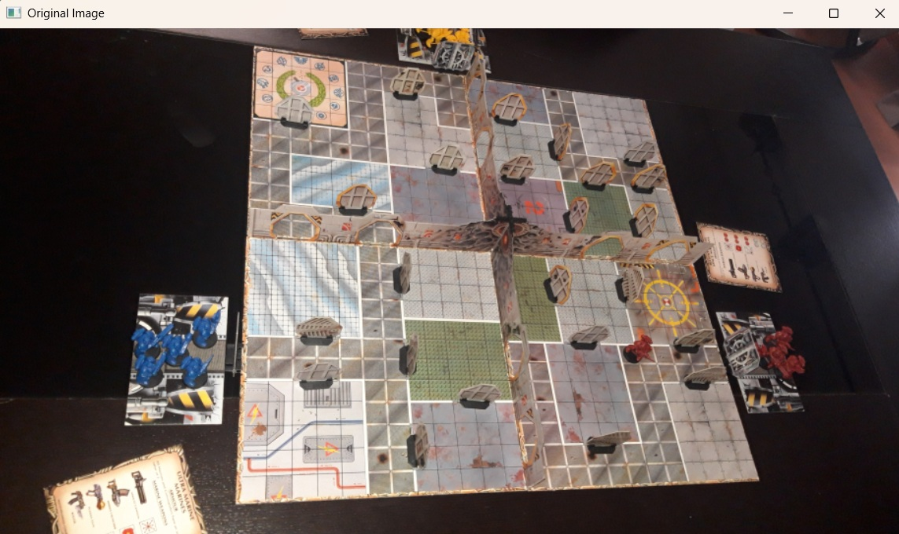
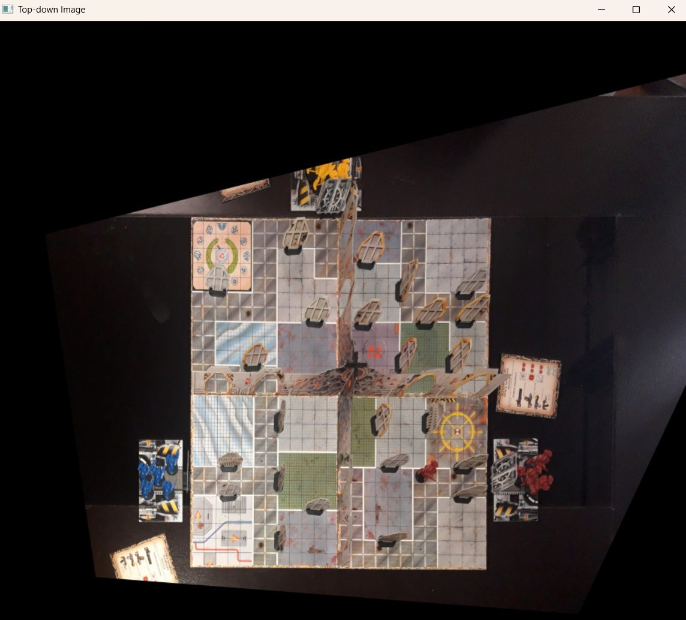
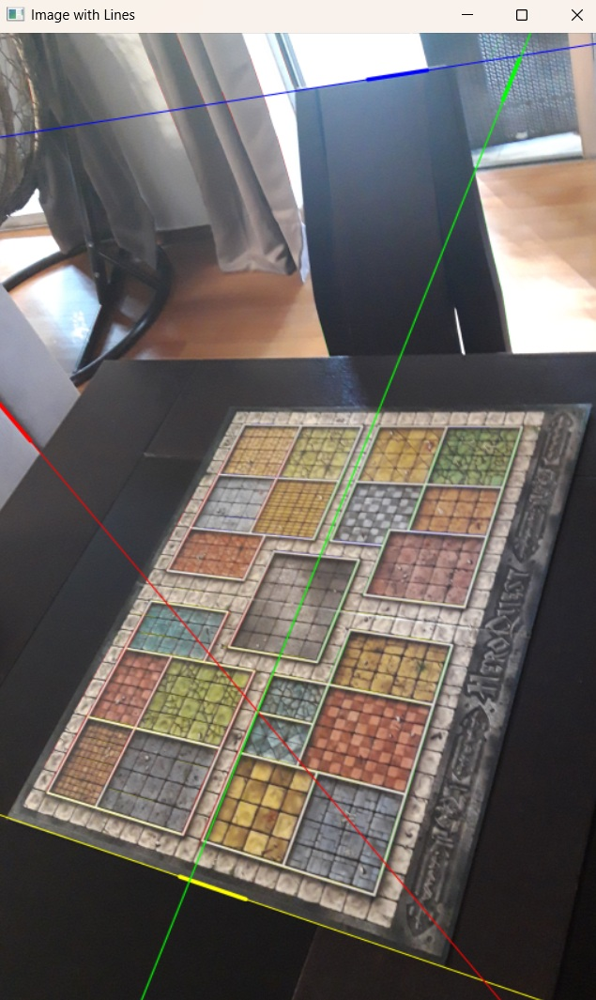

# Photo Perspective to Top-Down Transform

A Python script using **OpenCV** and **NumPy** to convert a perspective photo of a rectangular board into a corrected top-down view.  
The algorithm detects edges, extracts representative lines, computes their intersections to identify the four corners, and applies a perspective transform to warp the image into a rectangular canvas.

---

## Features
- Detects board edges using Canny edge detection and Hough transform.
- Finds the most representative top, bottom, left, and right lines.
- Optional YOLO-based object detection to restrict line selection to relevant regions.
- Computes intersections to identify the four corners.
- Applies perspective transform to generate a corrected top-down image.
- Returns both the transformed image and the 3×3 perspective matrix.
- Debug mode with visualizations of detected lines and corners.

---

## Requirements
- Python 3.x
- [OpenCV](https://pypi.org/project/opencv-python/)
- [NumPy](https://pypi.org/project/numpy/)

Install dependencies:
```bash
pip install opencv-python numpy
```

---

## Usage
Inside the script:
```
img = cv2.imread("input.jpg")
#top_down_img, M = get_topdown_board(img, debug=True)
top_down_img, M = get_topdown_board(img, model=r"train_tiles_augm\best.pt", debug=True)
show_image("Top-down Image", top_down_img, scale=0.2)
```
- debug=True shows intermediate steps (edges, lines, intersections).
- Output: corrected top-down image + perspective matrix M.

---

## Example
Original perspective photo:


Corrected top-down view:


Try to avoid including other objects in the photo, because the algorithm attempts to detect straight lines around the board’s perimeter.  
Below is an example where the photo is not focused on the board, and as a result the algorithm mistakenly selects unrelated lines:  


---

## License
This project is licensed under the MIT License. If you use this code in your project or publication, please include a credit mentioning George Paraskevopoulos in the acknowledgments or documentation.

---

## Acknowledgments
Developed by George Paraskevopoulos. Inspired by the need to easily transform perspective photos into top-down views for board detection and analysis.

